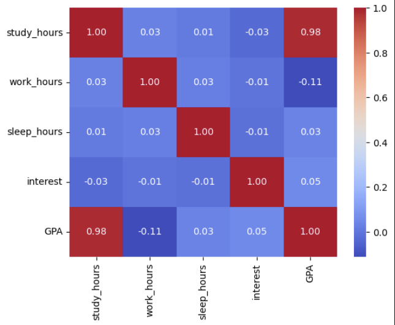
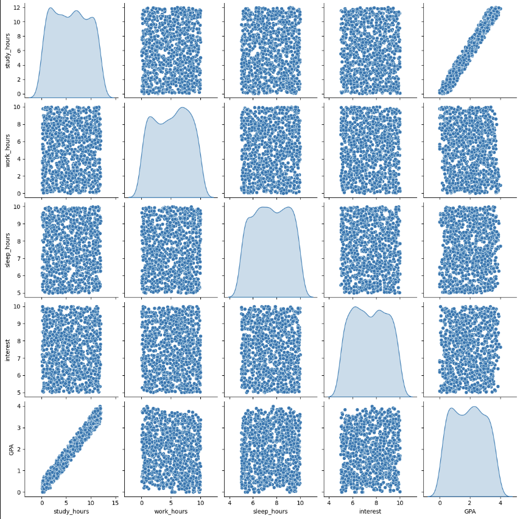

## GPA Calculator & Predictor

### Demo link: 
https://gpa-calculator-tj9p.onrender.com/

## **Overview**
This project helps students estimate and plan their academic performance by:

1. **Calculating the required GPA** needed to reach a target GPA based on remaining credits.
2. **Predicting a student’s GPA** based on their study habits, sleep, work hours, and interest levels.  
   - The model applies **feature engineering** to enhance prediction accuracy.

## **Impact**
✔️ **Reduces manual calculations and errors**  
✔️ **Helps students estimate their GPA based on lifestyle habits**  
✔️ **Aids in time management and academic planning for better results** 

### Dataset and Feature Engineering
A custom dataset [text](dataset/gpa.csv) containing study hours, work hours, sleep hours, and interest levels was used to train a linear regression model. Feature engineering was applied to enhance the model:

- **Interaction Feature**: `study_hours * interest` (captures the effect of interest level on study efficiency)
- **Log Transformation**: Applied to `work_hours` to handle non-linearity
- **Polynomial Features**: Used to model complex relationships between variable

#### Feature Correlation
A heatmap was used to visualize correlations between features:  

#### Data Distribution
A pairplot was generated to analyze feature distributions and relationships: 

## **Model Performance**
- **Mean Absolute Error (MAE)**: **0.0706** (Low error means accurate predictions)  
- **R² Score**: **0.9935** (Near perfect fit)  

This high R² score indicates that the model effectively predicts GPA based on input features.

## **Dekstop Application Available (Only Calculator Feature)**
- **Windows**: https://www.dropbox.com/s/0fs8xebol7ky8tc/app.zip?e=1&st=r2qkqt08&dl=0
- **Mac OS**: https://www.dropbox.com/s/oymxhdlk0kb48gu/app.app.zip?e=1&st=sabt97xz&dl=0
